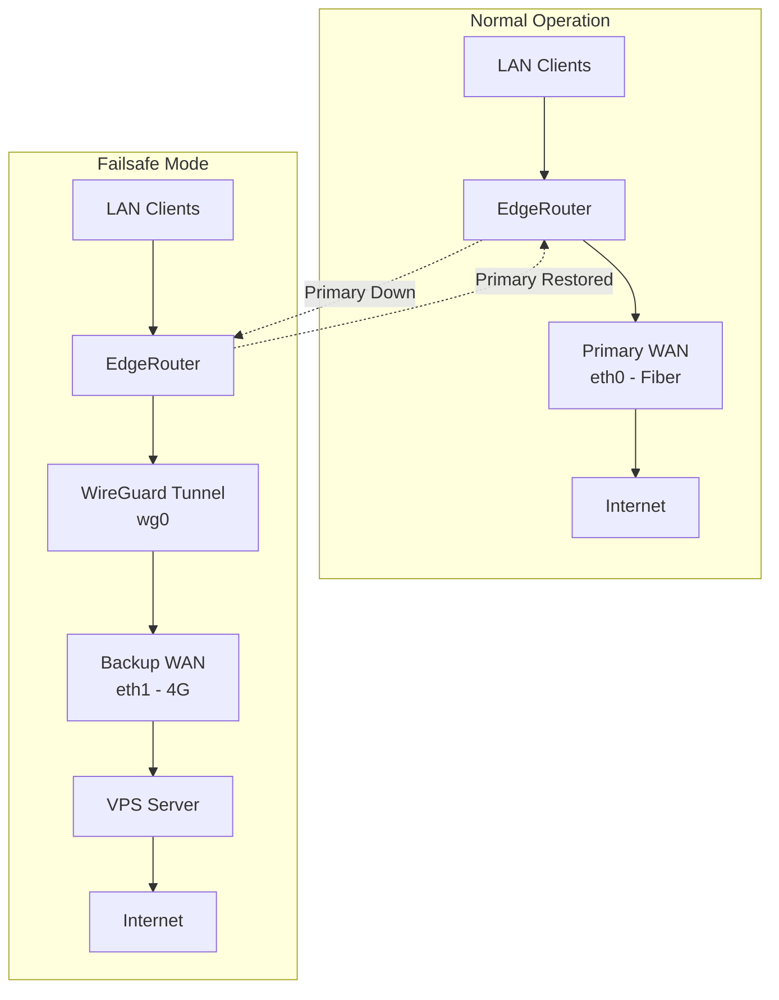

# WireGuard Failsafe Load Balancer

A robust automatic failover solution for EdgeRouter that provides seamless internet connectivity when your primary WAN connection fails. When the primary connection (fiber/ethernet) goes down, traffic automatically routes through a WireGuard VPN tunnel over your 4G backup connection to a VPS, ensuring zero-downtime internet access.

## Features

- **Automatic Failover**: Seamlessly switches to WireGuard tunnel when primary WAN fails
- **Zero Configuration After Setup**: Fully automatic operation once deployed
- **Policy-Based Routing Support**: Works correctly with EdgeOS load-balance and PBR
- **Fast Recovery**: Automatically restores primary connection when it comes back online
- **Comprehensive Logging**: Detailed logs for troubleshooting and monitoring
- **Recovery Tools**: Built-in recovery scripts for emergency situations

## How It Works



When your primary WAN (eth0) connection fails:
1. The system detects the failure via EdgeOS load-balance monitoring
2. WireGuard tunnel is automatically enabled
3. All routing tables are updated to route traffic through the tunnel
4. Traffic flows: LAN → EdgeRouter → WireGuard → 4G → VPS → Internet
5. When primary connection is restored, normal routing is automatically restored

## Quick Start

1. **Prerequisites**: Review [Prerequisites Guide](docs/01-prerequisites.md)
2. **VPS Setup**: Follow [VPS Setup Guide](docs/02-vps-setup.md)
3. **EdgeRouter Setup**: Follow [EdgeRouter Configuration Guide](docs/03-edgerouter-setup.md)
4. **Deploy Scripts**: Follow [Deployment Guide](docs/04-deployment.md)
5. **Test**: Follow [Testing Guide](docs/05-testing.md)

## Documentation

- **[01 - Prerequisites](docs/01-prerequisites.md)**: Hardware, software, and network requirements
- **[02 - VPS Setup](docs/02-vps-setup.md)**: Complete WireGuard setup on Ubuntu VPS
- **[03 - EdgeRouter Setup](docs/03-edgerouter-setup.md)**: EdgeRouter WireGuard and load-balance configuration
- **[04 - Deployment](docs/04-deployment.md)**: Script deployment and integration
- **[05 - Testing](docs/05-testing.md)**: Testing procedures and verification
- **[06 - Troubleshooting](docs/06-troubleshooting.md)**: Common issues and solutions
- **[07 - Architecture](docs/07-architecture.md)**: Technical architecture and workflows
- **[08 - Advanced](docs/08-advanced.md)**: Advanced configuration and customization

## Prerequisites Checklist

Before starting, ensure you have:

- [ ] EdgeRouter with EdgeOS 3.x or later (WireGuard support required)
- [ ] Two WAN interfaces configured (primary + 4G backup)
- [ ] Ubuntu 24.10 VPS with static public IP
- [ ] Root/sudo access to both EdgeRouter and VPS
- [ ] Port 51820/UDP open on VPS firewall
- [ ] Basic understanding of networking concepts

## Architecture Overview

The system uses EdgeOS load-balance monitoring to detect primary WAN failures. When a failure is detected:

1. **Detection**: Load-balance transition script triggers failsafe script
2. **Activation**: WireGuard interface is enabled and handshake is established
3. **Routing**: All routing tables (main, 201, 202, 10, etc.) are updated with WireGuard routes
4. **Traffic Flow**: All traffic routes through encrypted WireGuard tunnel to VPS
5. **Recovery**: When primary WAN is restored, routes are automatically restored

For detailed architecture and workflow documentation, see [Architecture Guide](docs/07-architecture.md).

## Key Components

### Scripts

**Essential Scripts** (required):
- **`wireguard-failsafe.sh`**: Main failsafe script that handles activation/deactivation
- **`wg-failsafe-recovery.sh`**: Emergency recovery tool for troubleshooting
- **`init-wg-handshake.sh`**: Boot-time script to establish WireGuard handshake

**Utility Scripts** (optional, in `scripts/utils/`):
- Diagnostic tools for troubleshooting
- Testing scripts for verification
- See [scripts/utils/README.md](scripts/utils/README.md) for details

### Configuration

- **EdgeRouter**: WireGuard interface, load-balance group, policy-based routing
- **VPS**: WireGuard server configuration with NAT masquerade

## Testing

After deployment, test the failsafe system:

```bash
# Monitor logs
tail -f /var/log/wireguard-failsafe.log

# Test activation (simulate primary WAN failure)
# See docs/05-testing.md for safe testing procedures
```

## Troubleshooting

If you encounter issues:

1. Check [Troubleshooting Guide](docs/06-troubleshooting.md)
2. Review logs: `/var/log/wireguard-failsafe.log`
3. Use recovery script: `sudo /config/scripts/wg-failsafe-recovery.sh status`

## Contributing

Contributions are welcome! Please feel free to submit issues, feature requests, or pull requests.

## License

This project is licensed under the MIT License - see the [LICENSE](LICENSE) file for details.

## Support

For issues, questions, or contributions:
- Open an issue on GitHub
- Review the [Troubleshooting Guide](docs/06-troubleshooting.md)
- Check the [Architecture Documentation](docs/07-architecture.md) for technical details

## Acknowledgments

This project implements a robust failsafe mechanism for EdgeRouter using WireGuard, providing reliable internet connectivity even when the primary connection fails.

---

**Note**: This system is designed for EdgeRouter with EdgeOS. While the concepts may apply to other routers, the implementation is specific to EdgeOS load-balance and policy-based routing features.
