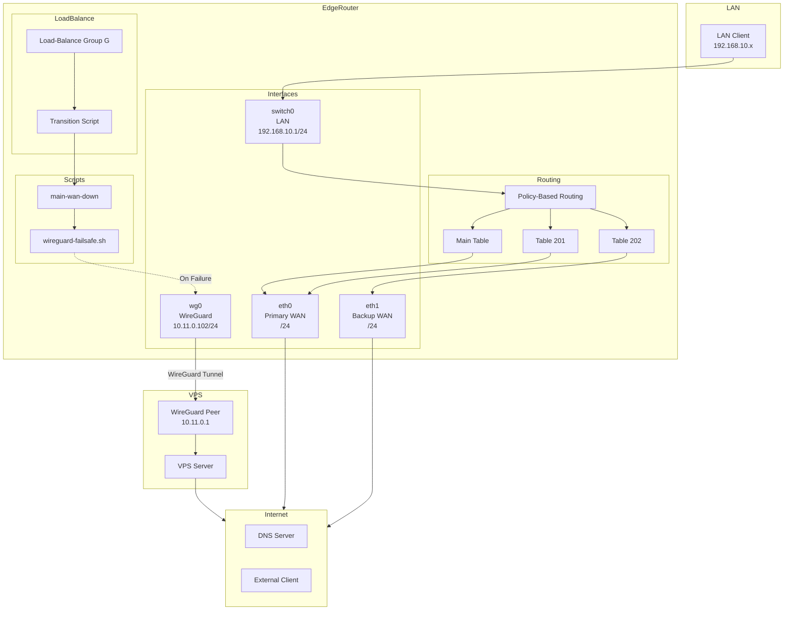

# Architecture Guide

This document provides a comprehensive technical overview of the WireGuard failsafe system, including architecture, workflows, routing mechanisms, and implementation details.

## Table of Contents

1. [System Overview](#system-overview)
2. [Problem Overview](#problem-overview)
3. [Workflow: Failsafe Activation](#workflow-failsafe-activation)
4. [Workflow: Failsafe Deactivation](#workflow-failsafe-deactivation)
5. [Routing Architecture](#routing-architecture)
6. [Traffic Flow Diagrams](#traffic-flow-diagrams)
7. [Implementation Details](#implementation-details)

## System Overview

The WireGuard failsafe system implements an automatic failover mechanism that routes traffic through a WireGuard VPN tunnel when the primary WAN (fiber/ethernet) connection fails. The EdgeRouter uses load-balance with policy-based routing (PBR) to manage dual WAN connections.

### High-Level Architecture



### Key Components

1. **EdgeRouter**: Manages dual WAN connections and routing
2. **VPS Server**: Acts as WireGuard endpoint and internet gateway
3. **Load-Balance System**: Monitors WAN interfaces and triggers failsafe
4. **Failsafe Scripts**: Handle automatic activation/deactivation
5. **Policy-Based Routing**: Routes traffic through appropriate tables

## Problem Overview

### The Root Issue: Policy-Based Routing (PBR) with Multiple Routing Tables

EdgeOS uses **policy-based routing** with multiple routing tables. Traffic is marked with fwmarks and routed to specific tables:

- **Table `main`** - Default/unmarked traffic
- **Table `201`** - Traffic marked for eth0 (via fwmark rules)
- **Table `202`** - Traffic marked for eth1 (via fwmark rules)
- **Table `10`** - Backup interface routes
- **Other tables** - Additional policy routing

### Original Problems

#### Problem 1: When Failsafe Was Active (eth0 down, WireGuard active)

**What Was Happening:**

```
┌─────────────────────────────────────────────────────────┐
│ Traffic Flow When Failsafe Active                      │
├─────────────────────────────────────────────────────────┤
│                                                          │
│ 1. Unmarked traffic → main table                        │
│    ✅ Had default route via WireGuard (10.11.0.1)       │
│    ✅ Worked! (myip showed correct VPS IP)             │
│                                                          │
│ 2. Marked traffic (fwmark) → table 201 or 202          │
│    ❌ Table 201 had: default via 192.168.1.1 (eth0)     │
│    ❌ Table 202 had: default via 192.168.2.1 (eth1)    │
│    ❌ eth0 gateway was DOWN → no route!                │
│    ❌ Traffic got dropped/lost                         │
│                                                          │
│ Result: Some traffic worked, most didn't                │
└─────────────────────────────────────────────────────────┘
```

**Why "myip" Worked But Sites Didn't:**
- `myip` checks often use unmarked traffic → main table → WireGuard → ✅ worked
- Web browsing uses marked traffic → policy tables (201/202) → broken gateways → ❌ failed

#### Problem 2: When eth0 Came Back (Recovery/Deactivation)

**What Was Happening:**

```
┌─────────────────────────────────────────────────────────┐
│ Traffic Flow When eth0 Came Back                        │
├─────────────────────────────────────────────────────────┤
│                                                          │
│ Script did:                                              │
│   1. ✅ Removed WireGuard route from main table         │
│   2. ✅ Added: default via 192.168.1.1 dev eth0        │
│                                                          │
│ BUT:                                                     │
│   ❌ Policy tables (201, 202) still had:                │
│      - Stale WireGuard routes (not removed)            │
│      - OR broken eth0 routes (gateway still unreachable)│
│                                                          │
│ Result:                                                  │
│   - Unmarked traffic → main → ✅ worked                 │
│   - Marked traffic → table 201/202 → ❌ broken         │
│   - Random failures depending on which table was used   │
└─────────────────────────────────────────────────────────┘
```

### The Fixes

1. **Failsafe Activation**: Now adds WireGuard default routes to **all policy tables** (201, 202, 10, etc.), not just main
2. **Failsafe Deactivation**: Now removes WireGuard routes from **all policy tables** and restores primary routes to **all policy tables**

## Workflow: Failsafe Activation

### Complete Timeline

```
┌─────────────────────────────────────────────────────────────┐
│ TIMELINE: eth0 Failure → WireGuard Failsafe Activation     │
├─────────────────────────────────────────────────────────────┤
│                                                               │
│ T+0s:  eth0 FAILURE EVENT                                    │
│        ├─ Cable unplugged                                    │
│        ├─ ISP outage                                         │
│        ├─ Gateway 192.168.1.1 unreachable                    │
│        └─ Physical link DOWN (LOWER_UP flag cleared)        │
│                                                               │
│ T+1s:  Script runs (cron/triggered)                          │
│        ├─ Check eth0: is_link_up("eth0") → ❌ FAIL          │
│        │   └─ No LOWER_UP flag → eth0_active = 0             │
│        │                                                      │
│        ├─ OR: Link up but gateway unreachable                │
│        │   └─ can_reach_gw("192.168.1.1", "eth0") → ❌ FAIL │
│        │   └─ eth0_active = 0                               │
│        │                                                      │
│        ├─ Check eth1:                                        │
│        │   └─ May be UP or DOWN (doesn't matter)          │
│        │                                                      │
│        └─ Decision: eth0_active=0 → ACTIVATE FAILSAFE      │
│                                                               │
│ T+2s:  activate_wg_failsafe() starts                          │
│                                                               │
│        ┌──────────────────────────────────────────────────┐ │
        │        │ STEP 1: Setup Endpoint Route                      │ │
        │        ├──────────────────────────────────────────────────┤ │
        │        │ ip route replace <VPS_PUBLIC_IP>/32              │ │
        │        │   via <BACKUP_GW> dev eth1                        │ │
│        │   metric 190                                      │ │
│        │                                                   │ │
│        │ Purpose: Ensure VPS endpoint is reachable        │ │
│        │         via eth1 (backup interface)             │ │
│        │                                                   │ │
        │        │ Test: ping <VPS_PUBLIC_IP> → ✅ SUCCESS           │ │
│        │ Log: "Endpoint route added"                       │ │
│        │ Log: "Endpoint reachable"                         │ │
│        └──────────────────────────────────────────────────┘ │
│                                                               │
│        ┌──────────────────────────────────────────────────┐ │
│        │ STEP 2: Ensure WireGuard Interface is UP          │ │
│        ├──────────────────────────────────────────────────┤ │
│        │ ip link set wg0 up                                │ │
│        │ sleep 1                                            │ │
│        │                                                   │ │
│        │ Purpose: Make sure interface is administratively │ │
│        │         enabled (may already be up)               │ │
│        └──────────────────────────────────────────────────┘ │
│                                                               │
│        ┌──────────────────────────────────────────────────┐ │
│        │ STEP 3: Check/Force WireGuard Handshake            │ │
│        ├──────────────────────────────────────────────────┤ │
│        │ Check: wg_is_really_up()                          │ │
│        │   ├─ Try: ping 10.11.0.1 → may FAIL (stale)       │ │
│        │   └─ Check: handshake age < 180s                  │ │
│        │                                                   │ │
│        │ If tunnel not responsive:                         │ │
│        │   1. Find peer public key (4 methods):            │ │
│        │      ├─ /config/auth/vps-peer-public.key         │ │
│        │      ├─ wg show wg0 (running config)              │ │
│        │      ├─ cli-shell-api (active config)             │ │
│        │      └─ /config/config.boot (static config)      │ │
│        │                                                   │ │
│        │   2. Force handshake:                             │ │
│        │      wg set wg0 peer <key>                       │ │
│        │        endpoint <VPS_PUBLIC_IP>:51820            │ │
│        │        persistent-keepalive 25                   │ │
│        │                                                   │ │
│        │   3. Wait 5 seconds for handshake                │ │
│        │                                                   │ │
│        │ Log: "Tunnel not responsive → forcing handshake" │ │
│        │ Log: "Found peer key → forcing handshake"        │ │
│        │ Log: "Handshake forced"                           │ │
│        └──────────────────────────────────────────────────┘ │
│                                                               │
│        ┌──────────────────────────────────────────────────┐ │
│        │ STEP 4: Wait for Tunnel to Come UP               │ │
│        ├──────────────────────────────────────────────────┤ │
│        │ Loop: max 20 seconds                             │ │
│        │   ├─ Check: wg_is_really_up()                    │ │
│        │   │   ├─ ping 10.11.0.1 → SUCCESS?               │ │
│        │   │   └─ OR: handshake age < 180s?               │ │
│        │   │                                              │ │
│        │   └─ If not up: sleep 1, retry                   │ │
│        │                                                   │ │
│        │ Success: "Tunnel UP after Ns"                     │ │
│        │ Failure: Detailed diagnostics + ERROR            │ │
│        └──────────────────────────────────────────────────┘ │
│                                                               │
│        ┌──────────────────────────────────────────────────┐ │
│        │ STEP 5: Add WireGuard Route to Main Table          │ │
│        ├──────────────────────────────────────────────────┤ │
│        │ ip -4 route replace default                      │ │
│        │   via 10.11.0.1 dev wg0                           │ │
│        │   metric 40 table main                            │ │
│        │                                                   │ │
│        │ Purpose: Route unmarked traffic via WireGuard    │ │
│        │                                                   │ │
│        │ Verify: Check route exists → ✅ SUCCESS          │ │
│        │ Retry: If verification fails, retry once            │ │
│        │                                                   │ │
│        │ Log: "Default route → WireGuard (main)"           │ │
│        │ Log: "Main table route verified"                  │ │
│        └──────────────────────────────────────────────────┘ │
│                                                               │
│        ┌──────────────────────────────────────────────────┐ │
│        │ STEP 6: Add WireGuard Routes to Policy Tables    │ │
│        ├──────────────────────────────────────────────────┤ │
│        │ Discover tables: get_policy_tables_with_defaults()│ │
│        │   ├─ Check: 10, 201, 202, 210                     │ │
│        │   ├─ Check: ip rule show (fwmark tables)        │ │
│        │   └─ Result: [201, 202, 10, ...]                 │ │
│        │                                                   │ │
│        │ For each policy table:                            │ │
│        │   ip -4 route replace default                    │ │
│        │     via 10.11.0.1 dev wg0                        │ │
│        │     metric 40 table <N>                          │ │
│        │                                                   │ │
│        │ Purpose: Route marked traffic (fwmark) via WG   │ │
│        │         This fixes "myip works but sites don't" │ │
│        │                                                   │ │
│        │ Log: "Added WireGuard routes to N policy table(s)"│ │
│        └──────────────────────────────────────────────────┘ │
│                                                               │
│        ┌──────────────────────────────────────────────────┐ │
│        │ STEP 7: Add PBR Rule for LAN Traffic             │ │
│        ├──────────────────────────────────────────────────┤ │
│        │ ip rule add from 192.168.10.0/24                │ │
│        │   table main priority 69                        │ │
│        │                                                   │ │
│        │ Purpose: Force LAN traffic to use main table     │ │
│        │         (which has WireGuard route)             │ │
│        │         This bypasses load-balancer rules        │ │
│        │                                                   │ │
│        │ Log: "PBR: LAN → main table"                     │ │
│        └──────────────────────────────────────────────────┘ │
│                                                               │
│        ┌──────────────────────────────────────────────────┐ │
│        │ STEP 8: Check DNS (dnsmasq)                      │ │
│        ├──────────────────────────────────────────────────┤ │
│        │ If dnsmasq running:                              │ │
│        │   Test: nslookup google.com 192.168.10.1         │ │
│        │                                                   │ │
│        │ If DNS not resolving:                            │ │
│        │   /etc/init.d/dnsmasq restart                   │ │
│        │   sleep 3                                         │ │
│        │                                                   │ │
│        │ Log: "dnsmasq not resolving → restart"           │ │
│        │ OR: "dnsmasq OK - no restart"                    │ │
│        └──────────────────────────────────────────────────┘ │
│                                                               │
│ T+10s: "Failsafe ACTIVATED"                                  │
│        Script completes                                       │
└─────────────────────────────────────────────────────────────┘
```

### Final State After Activation

```
┌─────────────────────────────────────────────────────────────┐
│ Routing Tables After Failsafe Activation                      │
├─────────────────────────────────────────────────────────────┤
│                                                               │
│ Table "main":                                                 │
│   ✅ default via 10.11.0.1 dev wg0 metric 40                 │
│   ✅ Unmarked traffic routes via WireGuard                   │
│                                                               │
│ Table "201" (policy table for eth0):                         │
│   ✅ default via 10.11.0.1 dev wg0 metric 40                 │
│   ✅ Marked traffic (fwmark) routes via WireGuard           │
│                                                               │
│ Table "202" (policy table for eth1):                          │
│   ✅ default via 10.11.0.1 dev wg0 metric 40                 │
│   ✅ Marked traffic (fwmark) routes via WireGuard           │
│                                                               │
│ Table "10" (backup interface):                                │
│   ✅ default via 10.11.0.1 dev wg0 metric 40                │
│   ✅ Backup table routes via WireGuard                       │
│                                                               │
│ IP Rules:                                                     │
│   ✅ Priority 69: from 192.168.10.0/24 → table main       │
│      (Forces LAN traffic to main table with WG route)        │
│                                                               │
│ Endpoint Route:                                               │
│   ✅ <VPS_PUBLIC_IP>/32 via <BACKUP_GW> dev eth1 metric 190 │
│      (Ensures VPS endpoint reachable via eth1)               │
│                                                               │
│ WireGuard Interface:                                          │
│   ✅ wg0 UP                                                   │
│   ✅ Handshake active (< 180s old)                           │
│   ✅ Peer 10.11.0.1 reachable                                │
└─────────────────────────────────────────────────────────────┘
```

## Workflow: Failsafe Deactivation

### Complete Timeline

```
┌─────────────────────────────────────────────────────────────┐
│ TIMELINE: eth0 Recovery Process                              │
├─────────────────────────────────────────────────────────────┤
│                                                               │
│ T+0s:  eth0 cable plugged back in / link restored           │
│                                                               │
│ T+1s:  Script runs (cron or triggered)                      │
│        ├─ Detects: eth0 link UP                              │
│        ├─ Detects: Load-balancer reports "active"           │
│        ├─ Tests: ping 192.168.1.1 via eth0 → SUCCESS         │
│        └─ Decision: eth0_active=1, wg_route=1 → DEACTIVATE   │
│                                                               │
│ T+2s:  deactivate_wg_failsafe() starts                        │
│                                                               │
│        ┌──────────────────────────────────────────────────┐ │
│        │ STEP 1: Remove WireGuard from ALL policy tables │ │
│        ├──────────────────────────────────────────────────┤ │
│        │ remove_wg_routes_from_policy_tables()             │ │
│        │   ├─ Discover tables: 201, 202, 10, 210, etc.     │ │
│        │   ├─ Table 201: del default via 10.11.0.1 dev wg0│ │
│        │   ├─ Table 202: del default via 10.11.0.1 dev wg0│ │
│        │   ├─ Table 10:  del default via 10.11.0.1 dev wg0│ │
│        │   └─ Any other tables: cleaned                    │ │
│        │                                                   │ │
│        │ Log: "Removed WireGuard routes from N table(s)"   │ │
│        └──────────────────────────────────────────────────┘ │
│                                                               │
│        ┌──────────────────────────────────────────────────┐ │
│        │ STEP 2: Clean main table                         │ │
│        ├──────────────────────────────────────────────────┤ │
│        │ ├─ Remove: default via 10.11.0.1 dev wg0 (main) │ │
│        │ ├─ Remove: <VPS_PUBLIC_IP>/32 (endpoint)         │ │
│        │ ├─ Remove: ip rule priority 69 (LAN → main)    │ │
│        │ └─ Remove: stale eth1 defaults                   │ │
│        └──────────────────────────────────────────────────┘ │
│                                                               │
│        ┌──────────────────────────────────────────────────┐ │
│        │ STEP 3: Verify gateway reachability              │ │
│        ├──────────────────────────────────────────────────┤ │
│        │ can_reach_gw("192.168.1.1", "eth0")              │ │
│        │   ├─ Check route exists via eth0                │ │
│        │   └─ ping -c 1 -W 2 -I eth0 192.168.1.1          │ │
│        │                                                   │ │
│        │ If FAIL → abort, keep WireGuard active           │ │
│        │ If SUCCESS → continue                            │ │
│        └──────────────────────────────────────────────────┘ │
│                                                               │
│        ┌──────────────────────────────────────────────────┐ │
│        │ STEP 4: Restore primary to main table            │ │
│        ├──────────────────────────────────────────────────┤ │
│        │ ip -4 route replace default                      │ │
│        │   via 192.168.1.1 dev eth0                        │ │
│        │   metric 100 table main                           │ │
│        │                                                   │ │
│        │ Verify route exists (retry if needed)           │ │
│        │                                                   │ │
│        │ Log: "Default route → primary (main)"            │ │
│        │ Log: "Default route verified in main table"       │ │
│        └──────────────────────────────────────────────────┘ │
│                                                               │
│        ┌──────────────────────────────────────────────────┐ │
│        │ STEP 5: Restore primary to ALL policy tables    │ │
│        ├──────────────────────────────────────────────────┤ │
│        │ restore_primary_routes_to_policy_tables()         │ │
│        │   ├─ Discover tables: 201, 202, 10, 210, etc.   │ │
│        │   ├─ Table 201: default via 192.168.1.1 dev eth0│ │
│        │   ├─ Table 202: default via 192.168.1.1 dev eth0│ │
│        │   ├─ Table 10:  default via 192.168.1.1 dev eth0 │ │
│        │   └─ Any other tables: restored                 │ │
│        │                                                   │ │
│        │ Purpose: Ensure marked traffic works immediately │ │
│        │                                                   │ │
│        │ Log: "Restored primary routes to N table(s)"    │ │
│        └──────────────────────────────────────────────────┘ │
│                                                               │
│ T+3s:  "Failsafe DEACTIVATED"                                │
│                                                               │
│ T+4s:  All traffic now routes via eth0                      │
│        ├─ Unmarked traffic → main → eth0 ✅                 │
│        ├─ Marked traffic → 201/202 → eth0 ✅               │
│        └─ Full connectivity restored                        │
└─────────────────────────────────────────────────────────────┘
```

### Final State After Deactivation

```
┌─────────────────────────────────────────────────────────────┐
│ Routing Tables After eth0 Recovery (FIXED)                  │
├─────────────────────────────────────────────────────────────┤
│                                                               │
│ Table "main":                                                 │
│   ✅ default via 192.168.1.1 dev eth0 metric 100            │
│   ✅ Verified and working                                    │
│                                                               │
│ Table "201" (policy table for eth0):                         │
│   ✅ default via 192.168.1.1 dev eth0 metric 100            │
│   ✅ Primary route restored immediately                      │
│                                                               │
│ Table "202" (policy table for eth1):                          │
│   ✅ default via 192.168.1.1 dev eth0 metric 100            │
│   ✅ Primary route restored immediately                      │
│                                                               │
│ Table "10" (backup interface):                                │
│   ✅ default via 192.168.1.1 dev eth0 metric 100            │
│   ✅ Primary route restored immediately                      │
│                                                               │
│ Result: All tables have valid routes → Full connectivity   │
└─────────────────────────────────────────────────────────────┘
```

## Routing Architecture

### Visual Summary: Before vs After Fix

#### Before Fix (Broken State)

```
┌─────────────┐     ┌─────────────┐     ┌─────────────┐
│   Traffic   │     │   Table     │     │   Gateway   │
│             │     │             │     │             │
│ Unmarked ──→│────→│   main      │────→│ WireGuard  │ ✅
│             │     │             │     │ (10.11.0.1) │
└─────────────┘     └─────────────┘     └─────────────┘
                                           
┌─────────────┐     ┌─────────────┐     ┌─────────────┐
│   Traffic   │     │   Table     │     │   Gateway   │
│             │     │             │     │             │
│ Marked ─────│────→│   201/202   │────→│ eth0/eth1   │ ❌
│ (fwmark)    │     │             │     │ (DOWN!)     │
└─────────────┘     └─────────────┘     └─────────────┘
```

#### After Fix (Working State)

```
┌─────────────┐     ┌─────────────┐     ┌─────────────┐
│   Traffic   │     │   Table     │     │   Gateway   │
│             │     │             │     │             │
│ Unmarked ──→│────→│   main      │────→│ WireGuard  │ ✅
│             │     │             │     │ (10.11.0.1) │
└─────────────┘     └─────────────┘     └─────────────┘
                                           
┌─────────────┐     ┌─────────────┐     ┌─────────────┐
│   Traffic   │     │   Table     │     │   Gateway   │
│             │     │             │     │             │
│ Marked ─────│────→│   201/202   │────→│ WireGuard  │ ✅
│ (fwmark)    │     │             │     │ (10.11.0.1) │
└─────────────┘     └─────────────┘     └─────────────┘
```

### Key Improvements

1. **All Policy Tables Get Routes**: When failsafe activates, WireGuard routes are added to ALL discovered policy tables (201, 202, 10, 210, etc.), not just main
2. **Immediate Policy Table Restoration**: When eth0 comes back, primary routes are restored to ALL policy tables immediately, no waiting for load-balancer
3. **Consistent Routing**: All tables point to the same gateway (WireGuard when failsafe active, eth0 when normal)
4. **No Connectivity Gap**: Marked and unmarked traffic work immediately in both directions

## Traffic Flow Diagrams

### Normal Operation (eth0 Active)

```
LAN Client (192.168.10.50)
    │
    │ Outbound Traffic
    ▼
EdgeRouter
    │
    │ Policy-Based Routing
    ▼
Table 201 (eth0 routes)
    │
    │ Route via eth0
    ▼
Primary WAN (eth0)
    │
    │ Gateway: <PRIMARY_GW>
    ▼
Internet
```

### Failsafe Mode (WireGuard Active)

```
LAN Client (192.168.10.50)
    │
    │ Outbound Traffic
    ▼
EdgeRouter
    │
    │ Policy-Based Routing
    ├─→ Table main → WireGuard (wg0)
    ├─→ Table 201 → WireGuard (wg0)
    └─→ Table 202 → WireGuard (wg0)
    │
    │ All routes via 10.11.0.1
    ▼
WireGuard Tunnel (wg0)
    │
    │ Encrypted tunnel
    ▼
Backup WAN (eth1)
    │
    │ Gateway: <BACKUP_GW>
    ▼
VPS Server (<VPS_PUBLIC_IP>)
    │
    │ NAT masquerade
    ▼
Internet
```

## Implementation Details

### Script Configuration

Key variables in `wireguard-failsafe.sh`:

```bash
WG_IFACE="wg0"
WG_PEER_IP="YOUR_WG_PEER_IP"              # Replace with your VPS WireGuard tunnel IP (e.g., 10.11.0.1)
WG_ENDPOINT="YOUR_VPS_PUBLIC_IP"          # Replace with your VPS public IP (e.g., 203.0.113.10)
PRIMARY_DEV="eth0"
PRIMARY_GW="YOUR_PRIMARY_GW"              # Replace with your primary WAN gateway (e.g., 192.168.1.1)
BACKUP_DEV="eth1"
BACKUP_GW="YOUR_BACKUP_GW"                # Replace with your backup WAN gateway (e.g., 192.168.2.1)

METRIC_WG=40
METRIC_PRIMARY=100
METRIC_BACKUP=200
```

### Policy Table Discovery

The script automatically discovers policy tables with default routes:

```bash
get_policy_tables_with_defaults() {
    # Check common tables: 10, 201, 202, 210
    # Also discover via ip rule show (fwmark tables)
    # Returns list of tables that have default routes
}
```

### Lock Mechanism

Prevents multiple script instances:

- Lock file: `/var/run/wireguard-failsafe.lock`
- Timeout: 60 seconds
- Automatic stale lock cleanup

### Logging

- Log file: `/var/log/wireguard-failsafe.log`
- System logs: `/var/log/messages`
- Timestamped entries for all operations

## Summary

### What Was Fixed

1. **Failsafe Activation**: Now adds WireGuard default routes to **all policy tables** (201, 202, 10, etc.), ensuring marked traffic (fwmark) can reach the internet
2. **Failsafe Deactivation**: Now removes WireGuard routes from **all policy tables** and restores primary routes to **all policy tables**, ensuring no connectivity gap

### Key Takeaway

The issue was treating routing as a single-table problem. EdgeOS uses multiple routing tables for load balancing and policy routing. The script only updated the main table, leaving policy tables with broken routes. The fix ensures **all routing tables are updated consistently**, so both marked and unmarked traffic can reach the internet regardless of which table they use.

---

**Next**: [Advanced Guide](08-advanced.md) for customization and advanced configuration
